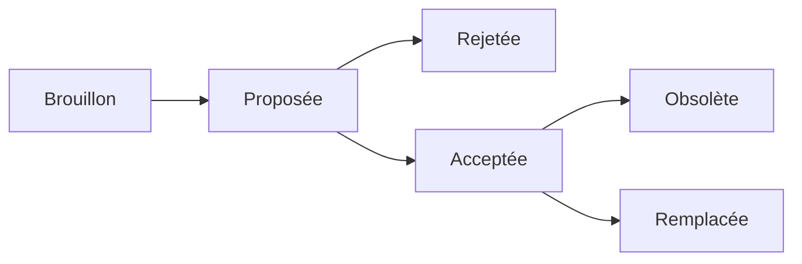

# Architecture Decision Record (ADR)

Une décision d'architecture est un choix de conception d'un logiciel qui répond à une exigence fonctionnelle ou non fonctionnelle importante. 
Le format des [ADR](https://adr.github.io/) prend en compte à la fois la date de prise de décision, du statut de la décision, les différentes options envisagées voire dans certains cas les conséquences de la décision par rapport au contexte du produit numérique construit.

Un enregistrement de décision d'architecture  capture une seule décision architecturale. L'ensemble des ADR créés et conservés dans le cadre d'un projet constitue son journal des décisions.

**Une ADR est immuable** : seul son statut peut changer (c'est-à-dire qu'elle peut devenir obsolète ou remplacée). Ainsi, l'on dispose de l'historique complet du projet en lisant simplement son journal de décisions dans l'ordre chronologique. 

En outre, le maintien de cette documentation vise à : 
- 🚀 Améliorer et accélérer l'intégration d'un nouveau membre de l'équipe 
- 🔭 Éviter l'acceptation/le retour aveugle d'une décision passée  
- 🤝 Formaliser le processus de décision de l'équipe

### Le statut d'une ADR peut avoir les états suivants :

▶️ Voici un exemple de modèle d'ADR: le [lien](./adr-template.md)

## Propositions de patrons d'architecture

Ce repository se propose de regrouper des propositions d'architecture sur différents patrons rencontrés dans le cadre de Cloud Pi Native, par exemple :
 - La gestion des [architectures asynchrones](./architecture_asynchrone/adr-asynchrone.md)
 - Les API managers dans les architectures projets
 - PostgreSQL en mode Cloud Native

⏳ **Ce contenu est en cours de mise en oeuvre et s'enrichiera au fur et à mesure.**
