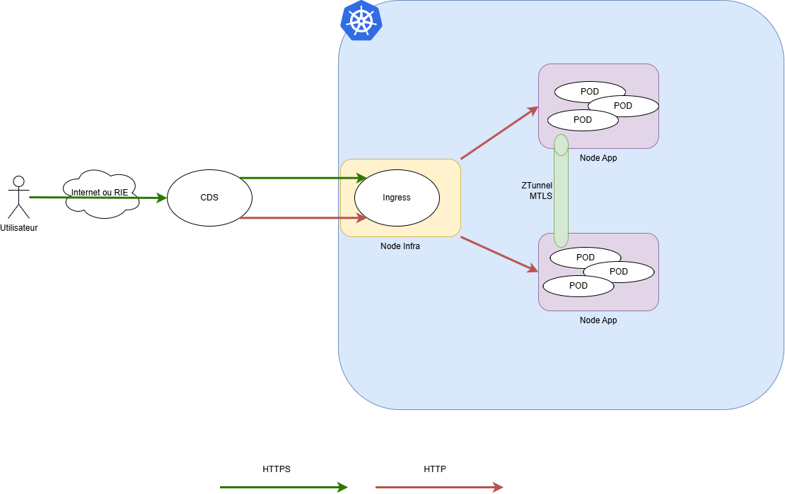

# Utilisation d'un Mesh sur CpIN

Cet AdR montre comment utiliser un service Mesh permettant de chiffrer les communication entre les nodes d'un cluster CPiN

## Statut

Brouillon

## Date

|Date | Status | Commentaires |
|---|---|---|
| 2025-11-20 | Brouillon | Première version |


## Participant

Les équipes CpiN suivante ont participé à cet AdR :
 - ServiceTeam
 - Exploitation

## Contexte et Problème

Les communications inter nodes des clusters Openshift sont par defaut non chiffrés. le but de cet AdR est de proposer une solution, la plus transparente pour les projets, permettant de chiffrer le contenu des communications entre les noeuds d'un cluster CPiN afin de se prémunir contre un attanquant qui arriverait à écouter le réseau.

De façon plus large, cette AdR présente comment chiffrer les flux sur l'ensemble de la chaine de communication d'un projet depuis le navigateur client jusqu'aux éléments applicatifs (POD)

Le schéma suivant présente les différentes étapes d'une requêtes dans CPiN



le trajet d'une requête HTTP(S) peut se découper en plusieurs phase :

| Phase | Source | Destination |Chiffré | Explications |
|-------|-----|-----|----|--------------|
| 1 | Navigateur Client | CDS | Oui | La CDS est le point de terminaison SSL d'une requête HTTPS depuis l'extérieur. Ce flux est *forcément* chiffré via TLS |
| 2 | CDS | Ingress/Route | A la main du projet | Suivant la configration de la CDS et de la route Openshift il est possible de configurer la CDS pour renvoyer le flux en https vers les ingress |
| 3 | Ingres | Pods applicatifs | Non | 
| 4 | Pods | Pods | A la main du projet | En activant le mesh, le flux passe par un ztunnel et en mTLS |

## Options Considérées

1. Sans service mesh (Ingress + NetworkPolicy + bibliothèques applicatives)
   - Avantages: simplicité opérationnelle, coût réduit, pas de sidecar
   - Inconvénients: mTLS bout-en-bout difficile, features hétérogènes dans le code, observabilité non uniforme, stratégies de trafic limitées
   - Rejetée: ne répond pas aux exigences de sécurité et de gouvernance transverses

2. Istio (sidecar model classique)
   - Avantages: couverture fonctionnelle complète (sécurité, trafic, observabilité), intégration Gateway API, large communauté, maturité
   - Inconvénients: overhead de sidecar, complexité d'exploitation
   - Non retenue

3. Istio Ambient (sans sidecar)
   - Avantages: réduction overhead, modèle L4/L7 séparé
   - Inconvénients: encore en évolution, soucis de deploiement sur des clusters managés
   - Retenue

## Décision

Nous adoptons Istio en modèle ambient pour fournir un service mesh au trafic est-ouest, actuellement le trafic nord-sud est géré par l'openshift-router/OVN et ne permet pas de gérer le chiffrement de bout en bout.

Les piliers visés pour la mise en place d'Istio ambient:

- Possibilité d'ajouter individuellement des élements au mesh avec le label `dataplane-mode=ambient` par namespace/deployment/...
- Chaque projet pourra définir des `PeerAuthentication` et `AuthorizationPolicy` minimales
- **Dans un second temps** intégrer à la Gateway API pour l'exposition nord-sud, en cohérence avec l'ADR API Gateway

###  Activation par les projets 

L'activation par les projets se fait en plusieurs étapes :
 - Passage de l'ingress en https
 - Utilisation d'Istio Ambient


**Passage de l'ingress en https**
Le passage en https se fait via l'annotation 

```yaml
  annotations:
    route.openshift.io/termination: edge
```
ainsi que la configuration TLS
```yaml
  tls:
  - hosts:
    - mon.url.rie
    secretName: monsecret
```

Exemple :

```yaml
apiVersion: networking.k8s.io/v1
kind: Ingress
metadata:
  annotations:
    route.openshift.io/termination: edge
  name: moningress
spec:
  rules:
  - host: mon.url.rie
    http:
      paths:
      - backend:
          service:
            name: monservice
            port:
              name: http
        path: /
        pathType: Prefix
  tls:
  - hosts:
    - mon.url.rie
    secretName: monsecret
```

Ensuite, il faut configurer la CDS pour qu'elle renvoie le traffic en https. Cela se fait via son CPH ou via le paramètre ```redirect: true``` sur OpenCDS

**Utilisation d'Istio Ambient**

Un projet peut ajouter le label suivant à ses charges de travail sur ses deployment / STS :
```yaml
apiVersion: apps/v1
kind: Deployment
metadata:
  name: mon-app
  labels:
    dataplane-mode: ambient
```


## Conséquences

Effets positifs:

- Sécurité par défaut _possible_: chiffrement mTLS, identité de service, gestion des politiques de sécurité par projet
- Résilience accrue et pilotage fin du trafic sans refactor applicatif
- Observabilité transverse unifiée facilitant SLO/SLA et troubleshooting

Effets négatifs / coûts:

- Besoin de montée en compétence de l'équipe
- Mise en place des outils de monitoring et exploitation de la solution

Actions en cours:

- PoC avec un projet pilote pour valider la solution

## Liens et Références

- Istio Docs: `https://istio.io/latest/docs/`
